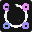

#  knots-hub

The highest level software in the Knots studio pipeline. Used directly by
artist to interract with the pipeline.

> [!WARNING]
> The hub only works on Windows yet but as been planned to include Linux 
> support in the future.

# design

The hub wraps every other piece of software in use at Knots and ensure they
are properly configured and installed.

The hub is designed for our specific need and might not suit every studio. One
of our major need being to go local-first when possible. Our network infratructure
being pretty minimal we defer of storing as much software possible on the user
local machine to avoid reducing performances.

The hub is reponsible of installing himself on the user machine, using
pre-compiled executable provided arbitrarly. We could have used a seperate
installer and the hub but to reduce maintenance they are both combined in 
the same code.
